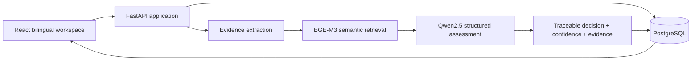

# NDMO Governance Intelligence Platform

An independent, bilingual data-governance portfolio project for assessing NDMO-aligned controls, analyzing organizational evidence locally, measuring data quality, and tracking remediation from a single workspace.


> **Portfolio disclaimer**  
> This is an independent prototype and is not an official NDMO product, certification service, or legal compliance determination. All public demo records are synthetic and AI-generated.

## Project links

- **Source code:** [GitHub Repository](https://github.com/rahk2003/ndmo-platform)
- **Live demo:** Public deployment coming soon
- **LinkedIn:** [Rana Hassan Kenani](https://www.linkedin.com/in/rana-kenani-/)

## Why this project exists

Governance teams often review requirements, evidence files, ownership records, data-quality findings, and remediation plans across disconnected spreadsheets. This platform brings those activities together and preserves the source behind every decision.

The project is designed around four principles:

- **Traceability:** every assessment decision links back to evidence and its location.
- **Human oversight:** authorized reviewers can confirm or correct automated decisions.
- **Privacy by design:** the full AI profile runs locally through Ollama.
- **Operational follow-through:** gaps become owned, dated, auditable remediation actions.

## Key highlights

- 14 governance domains and 42 reference assessment questions.
- Local LLM inference with Qwen2.5 through Ollama.
- Multilingual semantic evidence retrieval using BGE-M3.
- Arabic and English enterprise interface with RTL/LTR support.
- Human review, evidence traceability, confidence, and audit history.
- Data-quality profiling, recommendations, and remediation tracking.
- Role-based access control with a public read-only demo profile.
- Docker, GitHub Codespaces, and automated CI verification.

## Technology stack

| Layer | Technologies |
|---|---|
| Frontend | React 19, Vite, JavaScript |
| Backend | FastAPI, Python |
| Database | PostgreSQL 16 |
| Local AI | Qwen2.5, BGE-M3, Ollama |
| Infrastructure | Docker, Docker Compose, GitHub Codespaces |
| Quality | Unit tests, ESLint, frontend build checks, GitHub Actions |

## Product capabilities

- Arabic and English enterprise interface with RTL/LTR support.
- NDMO-aligned assessment workspace covering 14 governance domains and 42 reference questions.
- Local evidence analysis for Excel, CSV, PDF, and TXT files.
- Semantic evidence retrieval with multilingual `bge-m3` embeddings.
- Structured `yes` / `partial` / `no` decisions from `qwen2.5:7b-instruct`.
- Manual review, confidence, reasoning, evidence excerpts, and evidence locations.
- Data-quality profiling for completeness, uniqueness, validity, PII signals, and column-level issues.
- Evidence-driven recommendations and persistent remediation plans.
- Role-based access control and database-backed audit history.
- Gregorian dates throughout the interface.

## Try the read-only demo locally

The Docker demo starts the complete web application with PostgreSQL, a synthetic portfolio dataset, and a read-only account. Live model inference is intentionally disabled in this profile so the demo starts quickly and does not download model weights.

```bash
git clone https://github.com/rahk2003/ndmo-platform.git
cd ndmo-platform
docker compose up --build
```

Open [http://localhost:5173](http://localhost:5173) and sign in with:

| Field | Demo value |
|---|---|
| Username | `demo.viewer` |
| Password | `ViewOnly2026!` |
| Access | Viewer — read only |

The viewer can browse dashboards, assessment results, evidence analysis, data-quality reports, and recommendations. Write operations are blocked by backend authorization.

Stop the demo with:

```bash
docker compose down
```

To remove the synthetic demo database volume:

```bash
docker compose down -v
```

## GitHub Codespaces

1. Open the repository on GitHub.
2. Select **Code → Codespaces → Create codespace on main**.
3. Wait for the containers to build and for port `5173` to open.
4. Sign in using the same read-only demo credentials.

The included dev-container configuration builds and starts the demo automatically.

## Run the full local AI profile

The full profile enables live Qwen assessment and semantic retrieval. It requires PostgreSQL and [Ollama](https://ollama.com/) on the host machine.

### 1. Install the local models

```bash
ollama pull qwen2.5:7b-instruct
ollama pull bge-m3
```

### 2. Configure the backend

```bash
cp backend/.env.example backend/.env
```

Update the PostgreSQL values in `backend/.env`. The default AI configuration uses:

```env
AI_PROVIDER=ollama
AI_MODEL_NAME=qwen2.5:7b-instruct
EMBEDDING_PROVIDER=ollama
EMBEDDING_MODEL_NAME=bge-m3
EVIDENCE_RETRIEVAL_MODE=semantic
```

### 3. Install dependencies

```bash
python3 -m venv .venv
source .venv/bin/activate
python -m pip install -r backend/requirements.txt
cd frontend && npm ci && cd ..
```

### 4. Start the platform

```bash
python run_local.py
```

Open [http://127.0.0.1:5173](http://127.0.0.1:5173). On a new database, the platform seeds the reference catalog and asks for the first administrator account. There is no default administrator password.

## Runtime profiles

| Profile | Purpose | AI behavior | Account behavior |
|---|---|---|---|
| Docker demo | Portfolio review | Displays stored synthetic Qwen results; no live inference | Public viewer account, read only |
| Full local | Evidence analysis and development | Live Qwen2.5 + BGE-M3 through Ollama | First administrator is created securely |

## Architecture



## Evidence decision flow

1. Validate and store the uploaded evidence file.
2. Extract bounded, traceable rows or document sections.
3. Build multilingual semantic embeddings with BGE-M3.
4. Retrieve evidence by meaning rather than keyword overlap.
5. Ask Qwen for a constrained assessment decision and explanation.
6. Save the decision, confidence, excerpt, location, and model metadata.
7. Allow an authorized reviewer to approve or correct the result.

If semantic embeddings fail in the full profile, analysis stops with a clear error. The platform does not silently fall back to keyword matching.

## Roles and permissions

| Role | Main permissions |
|---|---|
| `admin` | Account administration and all platform operations |
| `analyst` | Upload evidence, run analysis, and manage remediation |
| `reviewer` | Review decisions, update remediation, and read the audit log |
| `viewer` | Read-only access to portfolio results |

Backend authorization remains the source of truth; write requests from a viewer receive `403 Forbidden`.

## Privacy and security notes

- Passwords use salted PBKDF2-HMAC-SHA256 hashes.
- Session tokens are randomly generated and only token hashes are stored.
- Upload size, file type, and expanded Excel archive limits are enforced.
- Sensitive operations are recorded in an audit log.
- `.env`, virtual environments, model artifacts, uploaded evidence, and generated builds are excluded from Git.
- The public demo password is intentionally published and is valid only in `DEMO_MODE`; it never creates an administrator.
- Public demo records are synthetic and do not contain real organizational evidence.

## Repository structure

```text
.
├── backend/                 FastAPI API, security, migrations, and tests
├── frontend/                React application and bilingual UI
├── .devcontainer/           GitHub Codespaces configuration
├── .github/workflows/       Continuous integration
├── docs/                    Portfolio and publishing material
├── CONTRIBUTING.md          Contribution and synthetic-data rules
├── SECURITY.md              Private vulnerability reporting guidance
├── docker-compose.yml       Read-only synthetic demo stack
└── run_local.py             Full local development launcher
```

## Verification

```bash
# Backend
cd backend
python -m unittest discover -s tests -v

# Frontend
cd ../frontend
npm test
npm run lint
npm run build
```

GitHub Actions runs the same checks for pushes and pull requests.

## Current scope and roadmap

This release is a portfolio-grade prototype. Planned production work includes:

- Public deployment of the read-only demo.
- A reviewed, versioned control library mapped to the applicable official framework release.
- A held-out evaluation set and published model quality metrics.
- Background job processing with persistent progress for long-running live analyses.
- Production deployment hardening, observability, backups, rate limiting, and HTTPS.
- An NDMO-specific fine-tune after collecting enough balanced, approved review examples.

## Author

**Rana Hassan Kenani**  
AI Engineer focused on data governance, local LLM applications, machine learning, and intelligent enterprise systems.

- [GitHub](https://github.com/rahk2003)
- [LinkedIn](https://www.linkedin.com/in/rana-kenani-/)

## License

Copyright © 2026 Rana Hassan Kenani.

The source may be cloned and run for non-commercial portfolio review, education, and technical evaluation. Redistribution, modification, and commercial use require permission. See [`LICENSE`](LICENSE).
